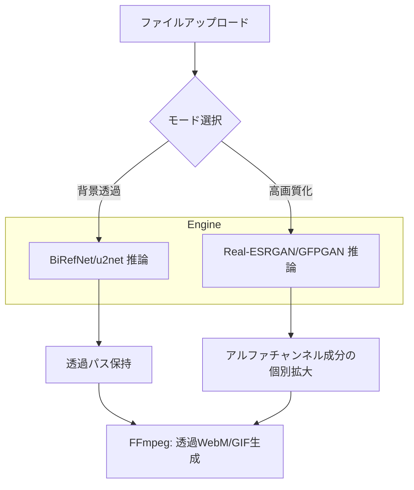

# Video Background Remover & Upscaler

AIを活用して動画や画像の背景を自動透過、または4倍の高画質化（超解像）を行うオールインワンWebアプリケーションです。最新の **BiRefNet** による背景除去と、**Real-ESRGAN** による強力な高画質化機能を備えています。


*実行例: 複雑な背景からの切り抜きと、アニメGIFの透明度を維持したままの4倍高画質化に対応。*

## 🌟 主な機能

### 1. 背景透過処理 (Background Removal)
- **最高精度のモデル**: 標準的な `u2net` に加え、髪の毛まで繊細に切り抜く最先端の `BiRefNet` モデルを選択可能。
- **柔軟な背景指定**: 透明背景だけでなく、合成用の黒・白・カスタム（クロマキー）色を自由に指定可能。
- **フル透過出力**: アルファチャンネル付き WebM および透過映像を生成。

### 2. 高画質化 (Super Resolution / Upscale)
- **AI超解像**: 画像や動画を2倍、4倍に美しく拡大する `Real-ESRGAN` 搭載。
- **顔修復機能**: `GFPGAN` と連携し、古い低画質動画の顔を驚くほど鮮明に復元。
- **アニメ特化モデル**: アニメ動画・イラストに最適化された専用モデルを選択可能。

### 3. 高度なGIFサポート (Advanced GIF Engine)
- **透過の完全維持**: 透過情報を持つGIFを読み込み、透明度を維持したまま高画質化が可能。
- **リアルタイム進捗**: アニメーションGIFの処理中も、動画と同様にフレーム単位での進捗表示とキャンセルが可能。

### 4. 快適なUI/UX
- **直感的なタブ切り替え**: 背景透過と高画質化をシームレスに切り替えて継続的に処理可能。
- **リソースモニタ**: CPU, RAM, GPU(VRAM) の使用状況をリアルタイムで監視。
- **安定したETA表示**: 過去の処理速度から残り時間を高精度に予測。

## 🛠 技術スタック

| カテゴリ | 技術 / ライブラリ |
| :--- | :--- |
| **Backend** | Python 3.x, Flask |
| **Upscale** | Real-ESRGAN (x4plus, x4plus_anime), GFPGAN |
| **BG Removal** | rembg (BiRefNet, u2net), ONNXRuntime-GPU |
| **Media Engine**| FFmpeg, OpenCV, Pillow |
| **Frontend** | Vanilla JavaScript (ES6+), CSS3 (Modern Glassmorphism) |
| **Acceleration** | NVIDIA CUDA 11.x/12.x, cuDNN 9.x |

## 📊 システムフロー

### 統合処理プロセス



## 🚀 セットアップ

### 1. 依存関係のインストール

FFmpegがシステムにインストールされ、PATHが通っていることを確認してください。

```bash
# 仮想環境の作成
python -m venv venv
.\venv\Scripts\activate

# ライブラリのインストール
pip install -r requirements.txt
# GPU用のtorch (環境に合わせてバージョン調整)
pip install torch --index-url https://download.pytorch.org/whl/cu124
```

### 2. cuDNNの設定

NVIDIA GPUをフル活用するために `cuDNN` の導入を推奨します。`app.py` 内で cuDNN のパスを自動追加する設定が含まれています。

### 3. 実行

```bash
run_app.bat  # または python app.py
```
ブラウザで [http://127.0.0.1:5000](http://127.0.0.1:5000) にアクセスします。

## 📝 最近の修正・改善点 (v2.0)

- **透過GIFの完全対応**: 透過GIFの高画質化において、背景が白く塗りつぶされる不具合を修正。
- **進捗追跡の統一**: GIFの高画質化も非同期処理（SSE）に統合し、進捗バーとキャンセル機能が有効化。
- **UI同期の最適化**: 処理終了後、タブを切り替えるだけで自動的に前の作業をクリーンアップし、次の作業へ移れるように改善。
- **OpenCVのアルファ保持**: 画像読み込み時に透過情報が破棄される `cv2.imread` の仕様を `IMREAD_UNCHANGED` で回避し、高精度な出力を実現。
