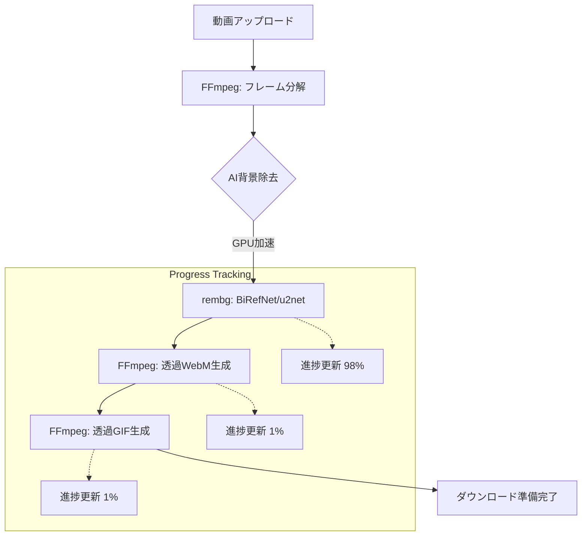
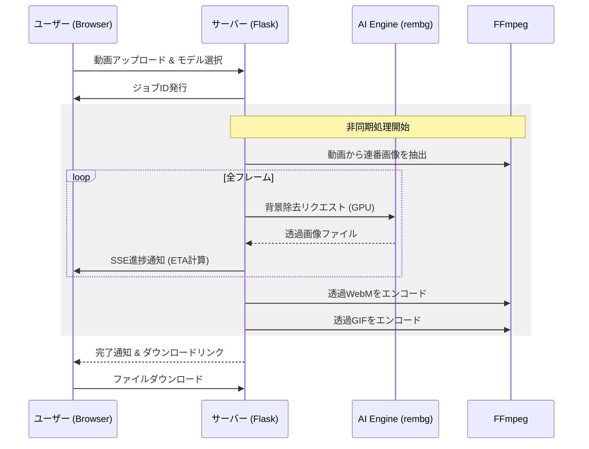

# Video Background Remover

AIを活用して動画の背景を自動で透過処理し、透過WebMおよび透過GIFを生成するWebアプリケーションです。最新の **BiRefNet** モデルをサポートし、人物や物体の境界線を非常に高精度に切り抜くことができます。


## 🌟 主な機能

- **高精度な背景除去**: 標準的な `u2net` に加え、最先端の `BiRefNet` モデルを選択可能。
- **GPU高速化**: NVIDIA RTX 3060 (CUDA/cuDNN) をフル活用した高速推論。
- **透過フォーマット出力**: アルファチャンネル付き WebM および 透過 GIF の生成。
- **リアルタイム進捗表示**: SSE（Server-Sent Events）による詳細な進捗状況と残り時間の目安表示。
- **メモリ最適化**: GPU VRAMの蓄積を防ぐための自動クリーンアップ機能。

## 🛠 技術スタック

| カテゴリ | 技術 / ライブラリ |
| :--- | :--- |
| **Backend** | Python 3.x, Flask |
| **AI / ML** | rembg (BiRefNet, u2net), ONNXRuntime-GPU |
| **Media Processing** | FFmpeg |
| **Frontend** | Vanilla HTML5, CSS3, JavaScript (ES6+) |
| **Acceleration** | NVIDIA CUDA 11.8+, cuDNN 9.x |

## 📊 システムフロー

### 処理プロセス（フローチャート）



### シーケンス図



## 🚀 セットアップ

### 1. 依存関係のインストール

FFmpegがシステムにインストールされ、PATHが通っていることを確認してください。

```bash
# 仮想環境の作成
python -m venv venv
.\venv\Scripts\activate

# ライブラリのインストール
pip install -r requirements.txt
# GPU用のtorchを追加
pip install torch --index-url https://download.pytorch.org/whl/cu118
```

### 2. cuDNNの設定（GPU利用時）

RTX 3060などのNVIDIA GPUを使用する場合、`cuDNN 9.x` の導入が必要です。

1. [NVIDIA公式](https://developer.nvidia.com/cudnn)からcuDNNをダウンロード。
2. `cudnn64_9.dll` 等のファイルを、venv内の `Lib\site-packages\onnxruntime\capi` またはシステムPATHの通った場所に配置してください。

### 3. 実行

```bash
python app.py
```
ブラウザで [http://127.0.0.1:5000](http://127.0.0.1:5000) にアクセスします。

## 📝 注意事項

- **メモリ消費**: BiRefNetモデルは非常に高精度ですが、GPU VRAMを大量に消費します。12GB以下のVRAM環境で実行する場合は、他のGPU使用アプリを閉じることを推奨します。
- **処理時間**: 動画の長さやフレームレートに比例して処理時間がかかります。8秒の動画で、RTX 3060を使用した場合、BiRefNetでは約3分〜5分程度が目安です。
